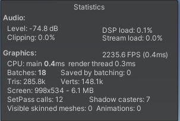

## 第四组 布料物理仿真结题报告

### 邹立凯 王执 邓诗羿

<p style="color:red">*此报告包含动图和公式，强烈建议使用Typora直接阅读md文件</p>

### 1. 项目简介

布料物理仿真是图形学仿真领域的一个重要研究方向，它在游戏和cg制作中有广泛的应用，例如衣服、旗帜等。尤其是实时渲染上，由于布料轻薄，运动时形变程度较大，同时容易与各种物体（包括自身）发生碰撞等，如果直接根据各种受力情况进行计算的话开销较大。目前工业界关于布料模拟的做法主要有法线贴图、骨骼绑定以及利用GPU的并行计算进行实时解算等多种方法。这次项目中我们的目标是实现一个可以实时渲染的布料物理仿真系统，并支持其与多种不同物体进行碰撞交互。

### 2. 项目描述

#### 2.1. 项目要求

实现一个基于物理的实时布料仿真系统，并支持布料与其他物体的碰撞交互。

#### 2.2. 预期实现目标

布料的物理仿真系统，能够与各类物体产生碰撞，也能与自身进行自碰撞。若布料被固定的情况下，还能对冲撞的物体产生一定的反作用力。通过ui界面修改布料参数控制其各种性质和形状，拖动物体进行碰撞。

#### 2.3. 实际实现内容

- 基于PBD的布料物理仿真，实现了两种布料内部约束
- 实现了布料和简单物体、高精度模型的碰撞
- 模拟了布料在风场中的物理效果
- 模拟了布料在受到过大外力后产生的撕裂效果
- 实现了布料BRDF物理渲染
- 实现了主要计算GPU并行化，加速计算
- 实现了编辑器UI，可以在空间中放置布料、简单几何体和高精度模型，同时可以更改相关物理参数
- 实现了三维空间的交互，用户可以从各个角度观察布料，并移动物体

### 3. 项目功能及技术点实现

首先，关于布料的物理仿真是基于Position Based Dynamics(PBD)，即基于位置的动力学。一张长方形的布料可以看成是由一定数量的方形点阵组成，通过对点之间建立约束来模拟布料的物理效果。

#### 3.1. 布料内部约束的实现

项目中布料主要运用了两种约束，分别是距离约束和弯曲约束。

- **距离约束**

  长度约束表示两个点之间的距离应该保持在一个定值，约束函数形式如下：
  $$
  C(\boldsymbol{x_1},\boldsymbol{x_2})=|\boldsymbol{x_{1,2}}|-d=0
  $$
  根据论文^[1]^得到顶点的矫正公式，如下（假设所有质点质量一样）：
  $$
  \Delta \boldsymbol{x_1}=-\frac{1}{2}(|\boldsymbol{x_{1,2}}|-d)\frac{\boldsymbol{x_{1,2}}}{|\boldsymbol{x_{1,2}}|} \\
  \Delta \boldsymbol{x_2}=+\frac{1}{2}(|\boldsymbol{x_{1,2}}|-d)\frac{\boldsymbol{x_{1,2}}}{|\boldsymbol{x_{1,2}}|}
  $$
  距离约束将运用到网格顶点的所有相邻边，具体图示见下：

  

  <p align="center" style="color:gray;">距离约束作用边示意图</p>

  如上图所示，对于单个顶点，它在网格上有6条边与其相连，网格中每个小方块的边长是超参，因此对角线长度也可以计算，即`sqrt(2)*gridSize`。使用方格边长作为水平和竖直方向的制动长度，对角线方向的边乘上$\sqrt{2}$即可。

- **弯曲约束**

  弯曲约束指的是两个平面的二面角应保持在一个定值，约束函数形式如下：
  $$
  C_{bend}(\boldsymbol{x_1},\boldsymbol{x_2},\boldsymbol{x_3},\boldsymbol{x_4})=acos(\frac{\boldsymbol{x_{2,1}}\times \boldsymbol{x_{3,1}}}{|\boldsymbol{x_{2,1}}\times \boldsymbol{x_{3,1}}|}\cdot \frac{\boldsymbol{x_{2,1}}\times \boldsymbol{x_{4,1}}}{|\boldsymbol{x_{2,1}}\times \boldsymbol{x_{4,1}}|})-\phi_0=0
  $$
  

  <p align="center" style="color:gray">Bending约束原理图</p>

  根据论文^[2]^计算得到顶点的矫正公式如下（假设$\boldsymbol{p_1}$是零向量且质点质量相同）：
  $$
  \begin{align*}
  	& \boldsymbol{n_1}=\frac{\boldsymbol{p_2}\times \boldsymbol{p_3}}{|\boldsymbol{p_2}\times \boldsymbol{p_3}|} \\
  	& \boldsymbol{n_2}=\frac{\boldsymbol{p_2}\times \boldsymbol{p_4}}{|\boldsymbol{p_2}\times \boldsymbol{p_4}|} \\
  	& d=\boldsymbol{n_1}\cdot \boldsymbol{n_2} \\
  	& \boldsymbol{q_3}=\frac{\boldsymbol{p_2}\times \boldsymbol{n_2}+(\boldsymbol{n_1}\times \boldsymbol{p_2})d}{|\boldsymbol{p_2}\times \boldsymbol{p_3}|} \\
  	& \boldsymbol{q_4}=\frac{\boldsymbol{p_2}\times \boldsymbol{n_1}+(\boldsymbol{n_2}\times \boldsymbol{p_2})d}{|\boldsymbol{p_2}\times \boldsymbol{p_4}|} \\
  	& \boldsymbol{q_2}=-\frac{\boldsymbol{p_3}\times \boldsymbol{n_2}+(\boldsymbol{n_1}\times \boldsymbol{p_3})d}{|\boldsymbol{p_2}\times \boldsymbol{p_3}|}-\frac{\boldsymbol{p_4}\times \boldsymbol{n_1}+(\boldsymbol{n_2}\times \boldsymbol{p_4})d}{|\boldsymbol{p_2}\times \boldsymbol{p_4}|} \\
  	& \boldsymbol{q_1}=-\boldsymbol{q_2}-\boldsymbol{q_3}-\boldsymbol{q_4} \\
  	& \Delta \boldsymbol{p_i}=-\frac{\sqrt{1-d^2}(arccos(d)-\phi_0)}{\sum_j|\boldsymbol{q_j}|^2}\boldsymbol{q_j}
  \end{align*}
  $$
  弯曲约束将运用到使用该顶点的平行四边形的两个三角面片中，如下图（不包含正方形）：

  

  <p align="center" style="color:gray">Bending约束作用边示意图</p>

  如上图所示，其中蓝色边是四边形共用的边，即二面角是以蓝色边为公共线的，红色边是涉及到要矫正的顶点。项目中一般设置$\phi_0=\pi$，这样整个布不会看上去过于软。

#### 3.2. 布料网格化参数计算

- **法线计算**

  顶点法线的计算较为简单，就是将网格中使用该顶点的三角形面片的法线用叉乘计算出来，归一化后得到至多6个（因为在后续布料撕裂中三角形面片可能会被破坏）单位法线，相加然后再次归一化即可，相当于对相邻三角面片的法线做了平均值，作为该顶点的法向量，图示如下：

  

  <p align="center" style="color:gray">顶点法线计算示意图</p>

- **切线计算**

  由参考资料^[3]^得，切线方向就是顶点纹理坐标$u$的变化方向与顶点法向量正则化之后的向量，计算方式如下（设$p_0$是我们要计算切线的点）：
  $$
  \begin{align*}
  	& \boldsymbol{q_0}=\boldsymbol{p_1}-\boldsymbol{p_0} \\
  	& \boldsymbol{q_1}=\boldsymbol{p_2}-\boldsymbol{p_0} \\
  	& \boldsymbol{T'}=\frac{1}{(u_1-u_0)(v_2-v_0)-(v_1-v_0)(u_2-u_0)}\cdot((v_2-v_0)\boldsymbol{q_0}+(v_0-v_1)\boldsymbol{q_1}) \\
  	& \boldsymbol{T}=\boldsymbol{T'}-\frac{\boldsymbol{T'}\cdot\boldsymbol{N}}{|\boldsymbol{T'}||\boldsymbol{N}|}\cdot|\boldsymbol{T'}|\cdot\boldsymbol{N}
  \end{align*}
  $$
  其中$u_i,v_i$指的是顶点$i$的纹理坐标，$\boldsymbol{N}$指的是顶点法线。

#### 3.3. 使用GPU加速计算

在项目初期，我们使用C#在Unity中编写脚本。但后来发现使用CPU进行顺序执行，效率过于低下。在31x31的顶点规模下，迭代次数为10的时候，帧数已经降到了30fps左右，远远不能满足项目的实时性需求，因此我们使用DirectX12提供的Compute Shader将代码迁移到GPU上，而C#脚本只负责Compute Shader的初始化与布料数据的生成。整个算法的流程如下：

```c#
ClothSimulate():
	Init cloth data
	Init compute buffer
	Init compute shader
	for loop in loopers:
		Dispatch NodeUpdateCS to compute position at next time step with Verlet
        for iter in iterCount:
			Dispatch lengthCS to correct position with length constraint
            Dispatch bendingCS to correct position with bending constraint
            Dispatch collisionResponseCS to deal with collision
    Dispatch linkCorrectionCS to deal with cloth tearing
    Dispatch normalCS to calculate normal
    Dispatch tangentCS to calculate tangent
    Dispatch accelerationCS to calculate external force
```

并行化的思想在于，$t+1$时刻顶点信息的计算是完全独立于同时间的其他顶点，而依赖于$t$时刻的顶点信息。因此在每个时刻计算出来的顶点信息可以根据顶点索引存到Compute Buffer中，供下一时刻顶点计算。采用类似的方法可以计算任意网格顶点信息，只要其不依赖于同一时刻的其他顶点信息即可。从上面的算法流程也可以看出，实际上求解的过程依然是顺序分步的，只不过在具体计算中采用了GPU并行化，因此中间性能消耗最大的计算过程的时间大大缩短。经过GPU并行化处理后，单帧的处理时间在0.7ms到1.3ms不等，完全满足了项目实时性的要求。

#### 3.4. 布料BRDF渲染

布料的BRDF采用的是*The Order: 1886*^[4]^游戏中天鹅绒材质的布料进行渲染，其中布料的几何衰减函数$G$被忽略，只采用法线分布函数$D$和菲涅尔反射$F$，公式如下：


其中在$f(\boldsymbol{l},\boldsymbol{v})$中，$(1-F(\boldsymbol{h},\boldsymbol{l}))\frac{\rho_{ss}}{\pi}$是漫反射项，其余的是镜面反射项。

同时渲染方面采用了法线纹理，这需要`3.2.`中计算的顶点切线方向。

另外值得提的一点是，由于布料有两个面而顶点只有一个法线，因此整个渲染流程要分为两个Pass。第一个Pass剔除背面，使用`3.2.`中计算的法向量计算光照；第二个Pass剔除正面，将法向反向然后计算。这样布料两个面的光照不会出现一摸一样的现象。

#### 3.5. 布料简单碰撞检测

- **球体碰撞**

  ```c#
  void SphereCollisionResponse(uint3 id : SV_DispatchThreadID) {
  	int index = id.x*_VerCountPerRow + id.y;
  	float4 pos = _P1_buffer[index];
  	if (length(pos - SphereCenter) < Radius) {
  		pos = SphereCenter + normalize(pos - SphereCenter)*Radius;
  		_P1_buffer[index] = pos;
  	}
  }	
  ```

  位置矫正的算法和爱丽丝头发作业中的碰撞算法相同。如果一个布料质点进入了球体范围内，那么就把它沿着球心连线方向移动至球体表面。

- **长方体碰撞**

  ```c#
  void CubeCollisionResponse(uint3 id : SV_DispatchThreadID) {
  	int index = id.x*_VerCountPerRow + id.y;
  	float4 pos = _P1_buffer[index];
  	pos = mul(Cuberot, pos);
  	if (Isincube(pos)) {
  		float ratio0 = abs(pos[0]) / CubeScale[0];
  		float ratio1 = abs(pos[1]) / CubeScale[1];
  		float ratio2 = abs(pos[2]) / CubeScale[2];
  		if (ratio0 == max(ratio0, max(ratio1, ratio2))) {
  			pos[0] = pos[0] / abs(pos[0])*CubeScale[0];
  		}
  		if (ratio1 == max(ratio0, max(ratio1, ratio2))) {
  			pos[1] = pos[1] / abs(pos[1])*CubeScale[1];
  		}
  		if (ratio2 == max(ratio0, max(ratio1, ratio2))) {
  			pos[2] = pos[2] / abs(pos[2])*CubeScale[2];
  		}
  		pos = mul(Cuberot_inv, pos);
  		_P1_buffer[index] = pos;
  		return;
  	}
  }
  ```

  1. 将布料质点的世界坐标乘以旋转矩阵转换到Cube的物体坐标中
  2. 根据Cube的长宽高判断质点是否在Cube内部
  3. 如果长方体内部，将质点移动至相对距离（绝对距离除以总长度）最近的表面。

  在这种碰撞矫正方法下，位于长方体棱角附近的质点间距离容易被拉大，产生后续的撕裂效果。

- **性能分析**

  

  <p align="center" style="color:gray">不考虑任何碰撞下，节点数量64*64，looper=6，iteration=42的计算性能</p>

  

  <p align="center" style="color:gray">碰撞阶段仅考虑简单碰撞，节点数量64*64，looper=6，iteration=42的计算性能</p>

  简单碰撞的情形下，逐点进行碰撞检测的计算复杂度为O(N)，计算消耗是可以承受的。在我们的迭代计算pipeline中，顶点的数据是存储在compute buffer中，逐点计算不涉及数据在cpu和gpu之间的传递，虽然迭代次数较多，但仍有良好的性能表现。我们也尝试过将布料节点不断四分（一个大块分成等尺寸的四小块，直至每个小块的节点数量为64）组成四叉树结构来加速计算，企图通过剔除较远节点来减小碰撞计算量，但是发现性能反而降低了，原因如下：

  1. 如果在c#脚本中进行递归的节点剔除，那么每个iteration都需要数据从gpu传递到cpu，并且每个待矫正的小布料块必须串行计算。虽然降低了计算量，但数据走总线的开销增加、并行计算的效率降低，在本作业的场景下得不偿失。
  2. 如果在compute shader中进行节点剔除，那么将在一个kernel中进行多重for循环的计算，大大降低了并行计算效率。

#### 3.6. 布料复杂碰撞检测

- **布料自碰撞**

  自碰撞检测是为了减少布料的自交叉现象，难点在于计算复杂度。我们的算法能支持256 * 256个节点的实时自碰撞检测，当量级达到512 * 512时，性能会急剧下降。算法流程如下：

  ```c#
  for i in range(NumPerRow/8):
  	for j in range(NumCol/8):
  	# 在compute shader中进行
  		小布料=smallclothindex(i,j) #由8*8个布料节点组成
  		for m in range(NumPerRow/16):
  			for n in range(NumCol/16):
  				碰撞对象=middleclothindex(m,n) #由16*16个布料节点组成
  				if 碰撞对象和小布料的距离很远
  					不考虑碰撞对象和小布料之间的自碰撞
  				else
  					将碰撞对象分解成四个小布料，再次进行距离检测
  					如果两个小布料很接近，则移动第一块小布料来扩大它们之间的距离
  					退出所有循环，保证每个iteration中每个节点的位置只会被更新一次
  ```

  思想是尽可能迅速地剔除无碰撞点，并避免并行过程中的数据冲突。

  性能分析如下：

  

  <p align="center" style="color:gray">碰撞阶段仅考虑自碰撞，节点数量64*64，looper=6，iteration=42的性能</p>

  

  <p align="center" style="color:gray">碰撞阶段仅考虑自碰撞，节点数量256*256，looper=6，iteration=42的性能</p>

  

  <p align="center" style="color:gray">碰撞阶段仅考虑自碰撞，节点数量512*512，looper=6，iteration=42的性能</p>

- **布料与高精度模型碰撞**

  - **算法1**

    1. 给bunny模型手动设置碰撞球（在轮廓的突出位置放上指定tag的空对象）
    2. 对于每个碰撞球，在Compute Shader中遍历所有布料节点，进行碰撞矫正

    发现效果很不如意，在20个碰撞球、调整后的碰撞半径下，计算消耗很大（但还能接受），碰撞效果差，完全不能体现bunny的形状。

  - **算法2**

    想法是用空间换时间，先将bunny模型空间划分成小块，然后预计算出每个小块的碰撞矫正向量，传入到compute buffer中，从而减小实时计算量。

    1. 在Start函数中，将bunny模型空间划分成60 * 100 * 40个小块，每个小块中存一个float3的向量，总计占用2M的显存空间
    2. 遍历兔子模型的mesh，获得每个模型顶点的位置和法向方向
    3. 将模型空间原点到模型顶点连线经过的每个空间网格的矫正向量设为该顶点对应的法向量
    4. iteration中，先将布料节点的世界坐标转换到bunny模型的空间坐标，再通过hash函数找到对应的空间网格，按其矫正向量进行位置矫正，从而达到碰撞的效果

    下图是按算法2实现的bunny模型碰撞检测的计算性能。

    

    <p align="center" style="color:gray">碰撞阶段仅考虑与bunny模型碰撞时的性能</p>

    在空间网格的初始化中，通过renderdoc查看buffer中的数据，发现240000个格点中有45000个格点中的数据中非0，占比超过1/6，保证了碰撞矫正的准确度。将空间划分成60 * 100 * 40个网格，既能保证初始化速度快、占用显存空间小，还能有较好的效果；我也尝试过扩大网格数量至300 * 500 * 200，除了大大增加初始计算的时间外，在效果上几乎没有提升。此外，碰撞矫正主要是矫正模型表面附近的布料节点，对于模型内部的节点，对矫正方向准确性的要求并不高，因此算法2中的步骤3是可行的。

#### 3.7. 布料风场模拟

风场实际上是一个关于风速的向量场，而对于质点的直接影响就是给其施加了一个除重力之外额外的力。根据文章^[5]^，风施加的力和风速的平方成正比，和迎风面积成正比，并且风力可以分解为和相对速度相反的阻力和垂直方向的升力。具体公式如下：
$$
\begin{align*}
	& \boldsymbol{v}_{rel}=\boldsymbol{v}_{object}-\boldsymbol{u} \\
	& \boldsymbol{F}_D=drag*|\boldsymbol{v}_{rel}|^2*Area*(\tilde{\boldsymbol{v}}_{rel}\cdot \tilde{\boldsymbol{n}})*(-\tilde{\boldsymbol{v}}_{rel}) \\
	& \boldsymbol{F}_L=lift*|\boldsymbol{v}_{rel}|^2*Area*cos(q)*((\tilde{\boldsymbol{n}}\times \tilde{\boldsymbol{v}}_{rel})\times\tilde{\boldsymbol{v}}_{rel})
\end{align*}
$$
其中风速是$\boldsymbol{u}$，$drag$和$lift$分别是阻力系数和升力系数，$Area$是三角形面积。向量上带有$\tilde{}$符号的是单位向量。有关风力的示意图如下：


<p align="center" style="color:gray">质点风力示意图</p>

以上是关于风速如何转换为质点收到的外力，接下来讨论如何生成具有随机性的风场。随机性的风场主要体现在不同质点处在不同的世界坐标中，其风力大小和方向都会发生微小的偏转。其次是风会随着时间而有规律的周期变化，因此我们风场的总体公式如下：
$$
\boldsymbol{v'}_{wind}=\boldsymbol{v}_{wind}*(1+a*sin(\omega t+\phi)+b*perlin(\boldsymbol{p}))
$$
其中$\boldsymbol{v}_{wind}$是初始风速，$a$是风的振幅，$w,\phi$是根据质点位置随机生成的常数，$b$是柏林噪声强度系数，$perlin(\boldsymbol{p})$根据顶点位置生成柏林噪声。有关柏林噪声的生成，见文献^[6]^。关于$perlin(\boldsymbol{p})$，包含对$\boldsymbol{p}$的预处理。需要将$\boldsymbol{p}$从世界坐标转换到风坐标系，然后提取其xy坐标，利用xy坐标生成对应的柏林噪声。这样提取出来的柏林噪声符合在同一时刻，噪声平面沿着风向是不变化的，只沿着风速垂直方向变化。

在根据随机风速求出风的升力和阻力后，将它们和重力相加形成质点合力，又假设质点质量为1，则合力大小就是加速度方向，然后更新Compute Buffer中的质点加速度供下一次loop的Verlet积分计算。

#### 3.8. 布料撕裂效果模拟

布料撕裂在本项目中被设计为，当网格的某一条边长度超过其止动长度`clothBreakThres`倍时，边断裂，同时在网格中使用这条边的两个三角形也不再渲染。边的断裂在项目中表现为，不再计算和这条边有关的约束和网格相关的参数。在渲染方面，要渲染的总顶点数没有变化，要不渲染指定三角形的办法很简单，只要改变网格三角形索引序列中对应的一项即可。举个例子，索引中有`[0, 1, 2]`三个索引，对应`0, 1, 2`三个顶点，只要将三角形索引改成`[0, 0, 2]`即可将三角形压缩成一条线，渲染结果上看来，这个三角形就像缺失了一样。

关于每个顶点与使用这个顶点的边之间的连接关系，在实现中使用了`uint`来存储边信息，通过`uint`不同位的01来判断顶点与这条边是否存在约束关系，换句话说就是这条边是否断裂了。关于不同方向边的编码如下：


<p align="center" style="color:gray">顶点邻边编码</p>

关于处理断裂边的检测是发生在顶点完成verlet积分计算，约束矫正和碰撞检测之后的。首先所有除了最右边一列和最下面一行的顶点会去检查其1、2、3号边是否超过了断裂阈值，超过了的话，将对应位置的三角形索引置为当前顶点。这一步可能会涉及到三角形索引赋值race，但结果是一样的，因为三角形索引无论置最后置为哪个顶点，结果都是这个三角形不再被渲染出来。完成1、2、3号边的遍历后，更新当前顶点的连接信息即可。

接下来是逆着再来一遍，即除了最上面一行和最左边一列的顶点，遍历其4、5、0号边，看对面的边信息是否已经将该边删除了。如果对面顶点已经删除了边的话，当前顶点也要删除对应边，然后更新当前顶点的边连接信息即可。

#### 3.9. UI界面设计

由于ui界面需要对布料的多个参数进行调整，因此参考了unity进行ui设计。采用卡片式的布局，并加上命名可以较为明显地区分仿真系统中的各个不同的物体。

对有范围限制的参数采用了Slider进行限制，防止用户自行调整参数时产生一些非常规的结果。

最下方是可以选择添加新物体的四个按钮。目前一共提供四种选择，分别代表了布料和三种不同的碰撞体类型——方块，球体和不规则网格。

布料可以动态设置锚点，但为防止每一次更新数据就更新锚点导致布料变动过大产生撕裂，因此需手动点击更新锚点才可真正更新锚点。


#### 3.10. 布料与物体交互设计

交互方面主要是移动物体与视角。

首先是调整视角。给Camera加上CharacterController进行移动控制。按住鼠标右键时，令鼠标控制进入锁住的状态。此时随着鼠标的移动，镜头朝向会随之旋转。若鼠标横向移动，则表示以y方向为轴进行旋转；纵向移动，则表示以x方向为轴进行旋转（这个方向的旋转限制旋转角度范围，避免产生翻转的情况）。

```c#
float mouseX = Input.GetAxis("Mouse X") * mouseSensitivity * Time.deltaTime;
float mouseY = Input.GetAxis("Mouse Y") * mouseSensitivity * Time.deltaTime;

xRotation -= mouseY;    // 左手系的原因 旋转方向和mouseY符号相反
xRotation = Mathf.Clamp(xRotation, -90.0f, 90.0f);
yRotation += mouseX;
this.transform.localRotation = Quaternion.Euler(xRotation, yRotation, 0.0f);
```

然后是摄像机的移动，由于unity提供的Input.GetAxis只能提供两个维度的方向控制，因此利用判断按键按下的状态来计算移动方向。

```c#
Vector3 move = new Vector3(0, 0, 0);
if (Input.GetKey(KeyCode.W)) {
	move += transform.up * speed * Time.deltaTime;
}
if (Input.GetKey(KeyCode.S)) {
	move += -transform.up * speed * Time.deltaTime;
}
if (Input.GetKey(KeyCode.A)) {
	move += -transform.right * speed * Time.deltaTime;
}
if (Input.GetKey(KeyCode.D)) {
	move += transform.right * speed * Time.deltaTime;
}
if (Input.GetKey(KeyCode.Q)) {
	move += -transform.forward * speed * Time.deltaTime;
}
if (Input.GetKey(KeyCode.E)) {
	move += transform.forward * speed * Time.deltaTime;
}
controller.Move(move);
```

控制物体的方式为，在点击物体的卡片后，卡片会将其控制的物体传给camera的cameraLook组件，接下来将该物体与控制箭头绑定，通过控制箭头的移动来控制物体


控制箭头有三个箭头模型构成，每一个箭头模型都带有一个碰撞体，在点击屏幕时，使用Ray来判断是否点击在某一箭头的碰撞体上，点击在碰撞体上则视为点击在对应的箭头上

```c#
if (Input.GetMouseButtonDown(0)) {
    Ray ray = Camera.main.ScreenPointToRay(Input.mousePosition);
    RaycastHit hit;
    if (Physics.Raycast(ray, out hit)) {
        Debug.Log(hit.collider.gameObject.name);
        switch (hit.collider.gameObject.name) {
            case "arrowX": directionFlag = Direction.dirX; isDrag = true; break;
            case "arrowY": directionFlag = Direction.dirY; isDrag = true; break;
            case "arrowZ": directionFlag = Direction.dirZ; isDrag = true; break;
            default: break;
        }
    }
    mousePos = Input.mousePosition;
}
```

拖动对应的箭头只能在对应的方向进行拖动。拖动首先将箭头的世界坐标转换到屏幕坐标，并根据z值和鼠标位置生成新的屏幕坐标（即鼠标的屏幕坐标），然后将其转换为世界坐标，与前一帧的世界坐标比较得到位移向量。对箭头只取其对应方向的坐标的改变。

```c#
if (isDrag) {
    ScreenSpace = Camera.main.WorldToScreenPoint(transform.position); //目标世界坐标转屏幕，获取z值
    curScreenSpace = new Vector3(Input.mousePosition.x, Input.mousePosition.y, ScreenSpace.z);//当前鼠标位置转世界
    offset = transform.position - Camera.main.ScreenToWorldPoint(new Vector3(mousePos.x, mousePos.y, ScreenSpace.z));
    CurPosition = Camera.main.ScreenToWorldPoint(curScreenSpace) + offset;

    switch (directionFlag) {
        case Direction.dirX:
        transform.position = new Vector3(CurPosition.x, transform.position.y, transform.position.z);
        break;
        case Direction.dirY:
        transform.position = new Vector3(transform.position.x, CurPosition.y, transform.position.z);
        break;
        case Direction.dirZ:
        transform.position = new Vector3(transform.position.x, transform.position.y, CurPosition.z);
        break;
    }
    mousePos = Input.mousePosition;
}
```

### 4. 效果展示

#### 4.1. 布料常规演示

- **从半空中落下**

  

- **移动旋转布料**

  

#### 4.2. 布料碰撞演示

- **与球体碰撞**

  

- **与正方体碰撞**

  

- **与高精度模型碰撞**

  

  <p align="center" style="color:gray">与stanford bunny碰撞</p>

- **布料自碰撞**

  

  <p align="center" style="color:gray">加入自碰撞检测前，抖动时容易发生自交叉</p>

  

  <p align="center" style="color:gray">加入自碰撞检测后，不易发生自交叉</p>

#### 4.3. 布料风场演示


#### 4.4. 布料撕裂演示


<p align="center" style="color:gray">长方体棱角戳出的小洞</p>


<p align="center" style="color:gray">菱形的小洞</p>


<p align="center" style="color:gray">机缘巧合下，兔子模型的耳朵戳出的大洞</p>

### 5. 总结与展望

本项目使用Unity平台实现了一个简易的布料物理仿真系统。其包含布料的一般物理仿真、风场模拟和布料的撕裂模拟。布料物理仿真使用了PBD来更新顶点位置，加入了距离约束和弯曲约束。在布料碰撞方面，我们实现了简单物体（方体和球体）的碰撞，同时还实现了复杂网格（高精度模型和布料自碰撞）之间的碰撞。 同时为了达到实时性的要求，将顶点位置计算并行化，使用Compute Shader在GPU中计算，大大减少了计算时间，从原来的一帧30+ms到现在的0.7ms左右，实现了性能质的飞跃。在布料渲染方面，我们采用了BRDF和法线贴图计算光照。同时我们还编写了用户交互界面，让用户可以在场景中动态创建布料和其他模型，在右侧属性面板调整物体属性，同时可以在场景中调整物体位置和用户视角。

项目的不足之处在于，现在的物体碰撞采用的是在C#脚本通过遍历tags来逐一和碰撞体进行碰撞检测，这在大型场景中性能会下降。这个可以通过k-d Tree，SAH，BVH来加速碰撞体检索。此外，最初我们想的是做出一个像Unity一样的编辑器，用户可以在界面中通过拖动坐标轴来完成移动，但由于时间和非项目重点的原因，这个部分没有做，只是用键盘完成物体的简单平移，操作不够User-friendly，未来可以将编辑器的操作部分完善一下。还有一点是，目前布料所支持的材质太少了，只有一种，未来可以编写更多的Shader，提供不同的贴图来生成不同材质的布料。

### 6. 参考资料

[1] Jan Bender. Position-Based Simulation Methods in Computer Graphics[J]. EUROGRAPHICS, 2015.

[2] Matthias Müller. Position Based Dynamics[J]. VRIPHYS, 2006.

[3] porry20009. 怎样计算模型的顶点切线[DB/OL]. http://blog.sina.com.cn/s/blog_15ff6002b0102y8b9.html, 2016-10-14.

[4] Ashikhmin. “Distribution-Based BRDFs” Technical Report, 2007. Cited on p. 357

[5] Gfans. Cloth Simulation[DB/OL]. https://zhuanlan.zhihu.com/p/76956578, 2019-08-09.

[6] Technical Writeup. Understanding Perlin Noise[DB/OL]. http://adrianb.io/2014/08/09/perlinnoise.html, 2014-08-09.

[7] Wojciechowski, Adam & Gałaj, Tomasz. (2016). GPU Assisted Self-Collisions of Cloths. Journal of Applied Computer Science. 24. 39-54. 

[8] Fuhrmann, A., Groß, C., and Luckas, V., Interactive Animation of Cloth In-cluding Self Collision Detection. In: WSCG, 2003.


